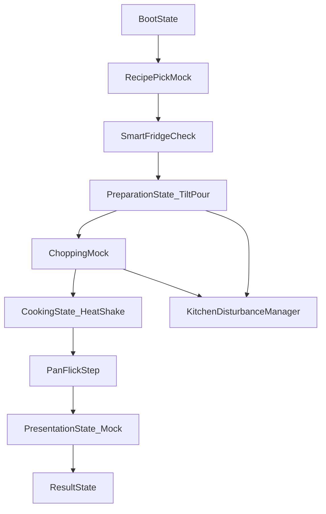

# แผนทำ `pep` ให้เล่นได้ครบ 1 รอบ

## เป้าหมายที่ยืนยันแล้ว
- ทำ **P1 vertical slice** เล่นได้จริงจากเริ่มเกมถึงหน้าผลลัพธ์
- ใช้ซีนใหม่: [`E:/Github2/NSC2026/Assets/pep/Scenes/PepDemo.unity`](E:/Github2/NSC2026/Assets/pep/Scenes/PepDemo.unity)
- โหมดรอบนี้เป็น **self-contained ใน `pep`** และวางช่องต่อ adapter สำหรับ `bright/coco` ไว้

## สิ่งที่มีอยู่แล้ว (นำมาใช้ต่อ)
- State machine: [`E:/Github2/NSC2026/Assets/pep/Scripts/Core/GameStateMachine.cs`](E:/Github2/NSC2026/Assets/pep/Scripts/Core/GameStateMachine.cs)
- Core data/score/inventory: [`E:/Github2/NSC2026/Assets/pep/Scripts/Core/PlayerDataManager.cs`](E:/Github2/NSC2026/Assets/pep/Scripts/Core/PlayerDataManager.cs), [`E:/Github2/NSC2026/Assets/pep/Scripts/Scoring/ScoringManager.cs`](E:/Github2/NSC2026/Assets/pep/Scripts/Scoring/ScoringManager.cs), [`E:/Github2/NSC2026/Assets/pep/Scripts/SmartFridge/InventoryManager.cs`](E:/Github2/NSC2026/Assets/pep/Scripts/SmartFridge/InventoryManager.cs)
- Recipe catalog/SO: [`E:/Github2/NSC2026/Assets/pep/Scripts/Recipe/RecipeCatalogManager.cs`](E:/Github2/NSC2026/Assets/pep/Scripts/Recipe/RecipeCatalogManager.cs), [`E:/Github2/NSC2026/Assets/pep/Scripts/Recipe/IngredientSO.cs`](E:/Github2/NSC2026/Assets/pep/Scripts/Recipe/IngredientSO.cs), [`E:/Github2/NSC2026/Assets/pep/Scripts/Recipe/RecipeSO.cs`](E:/Github2/NSC2026/Assets/pep/Scripts/Recipe/RecipeSO.cs)
- Minigame modules: [`E:/Github2/NSC2026/Assets/pep/Scripts/Minigames/Cooking/CookingState.cs`](E:/Github2/NSC2026/Assets/pep/Scripts/Minigames/Cooking/CookingState.cs), [`E:/Github2/NSC2026/Assets/pep/Scripts/Minigames/Cooking/PanFlickMinigame.cs`](E:/Github2/NSC2026/Assets/pep/Scripts/Minigames/Cooking/PanFlickMinigame.cs), [`E:/Github2/NSC2026/Assets/pep/Scripts/Minigames/Preparation/TiltPourMinigame.cs`](E:/Github2/NSC2026/Assets/pep/Scripts/Minigames/Preparation/TiltPourMinigame.cs)
- Event disturbance: [`E:/Github2/NSC2026/Assets/pep/Scripts/GameplayEvents/KitchenDisturbanceManager.cs`](E:/Github2/NSC2026/Assets/pep/Scripts/GameplayEvents/KitchenDisturbanceManager.cs)

## สถาปัตยกรรมรอบเกม (ที่จะทำ)

## แผนลงมือ
- เพิ่มตัวคุม flow กลางใหม่ (`PepGameBootstrap`) เพื่อเริ่มเกม, เปลี่ยน state, เรียกแต่ละมินิเกม และรวมผลคะแนนในรอบเดียว
  - ไฟล์ใหม่: [`E:/Github2/NSC2026/Assets/pep/Scripts/Core/PepGameBootstrap.cs`](E:/Github2/NSC2026/Assets/pep/Scripts/Core/PepGameBootstrap.cs)
- ทำ `PreparationState` และ `PresentationState` ให้ใช้งานจริงแบบ runtime UI mock
  - ไฟล์ใหม่: [`E:/Github2/NSC2026/Assets/pep/Scripts/Minigames/Preparation/PreparationState.cs`](E:/Github2/NSC2026/Assets/pep/Scripts/Minigames/Preparation/PreparationState.cs)
  - ไฟล์ใหม่: [`E:/Github2/NSC2026/Assets/pep/Scripts/Minigames/Presentation/PresentationState.cs`](E:/Github2/NSC2026/Assets/pep/Scripts/Minigames/Presentation/PresentationState.cs)
- ทำ Chopping mock step ให้ไม่บล็อก flow (กด/ลากสะสม progress) เพื่อให้วิ่งครบ state ได้
  - ไฟล์ใหม่: [`E:/Github2/NSC2026/Assets/pep/Scripts/Minigames/Chopping/ChoppingMockState.cs`](E:/Github2/NSC2026/Assets/pep/Scripts/Minigames/Chopping/ChoppingMockState.cs)
- เสริม Debug/Inspector ให้ setup ง่าย (ปุ่มเริ่ม/ข้าม state/รีเซ็ต/พิมพ์ snapshot)
  - ไฟล์ใหม่: [`E:/Github2/NSC2026/Assets/pep/Scripts/Editor/GameStateMachineEditor.cs`](E:/Github2/NSC2026/Assets/pep/Scripts/Editor/GameStateMachineEditor.cs)
  - ไฟล์ใหม่: [`E:/Github2/NSC2026/Assets/pep/Scripts/Editor/PepGameBootstrapEditor.cs`](E:/Github2/NSC2026/Assets/pep/Scripts/Editor/PepGameBootstrapEditor.cs)
- ปรับ scene เดโมใหม่ให้ prefab-less และผูก reference ครบใน Inspector ครั้งเดียว
  - สร้าง/แก้: [`E:/Github2/NSC2026/Assets/pep/Scenes/PepDemo.unity`](E:/Github2/NSC2026/Assets/pep/Scenes/PepDemo.unity)
  - มี GameObjects หลัก: `PepCore`, `PepMobileInput`, `PepMinigames`, `PepDebug`
- เตรียม adapter point (ยังไม่ hard bridge) สำหรับเชื่อม `bright/coco` รอบถัดไปผ่าน interface เดียว
  - ไฟล์ใหม่: [`E:/Github2/NSC2026/Assets/pep/Scripts/Integration/PepExternalFlowBridge.cs`](E:/Github2/NSC2026/Assets/pep/Scripts/Integration/PepExternalFlowBridge.cs)

## เกณฑ์จบงาน
- กด Play ใน `PepDemo` แล้ว flow เดินครบจนจบ Result ได้ทุกครั้ง
- ไม่ต้องวาง UI prefab เองเพื่อทดสอบ (runtime UI โผล่ครบ)
- ใน Inspector ของ `PepGameBootstrap` มีปุ่ม/ค่า debug สำคัญครบ และ reference หลัก auto-find ได้เมื่อเป็นไปได้
- คะแนนจาก `TiltPour`, `CookingState`, `PanFlick`, `Cockroach/ChoppingMock` ถูกรวมใน `ScoringManager` และสรุปผลท้ายเกมได้
- ไม่มี compile error ใหม่ และ lints ของไฟล์ที่เพิ่ม/แก้ไม่แตก
